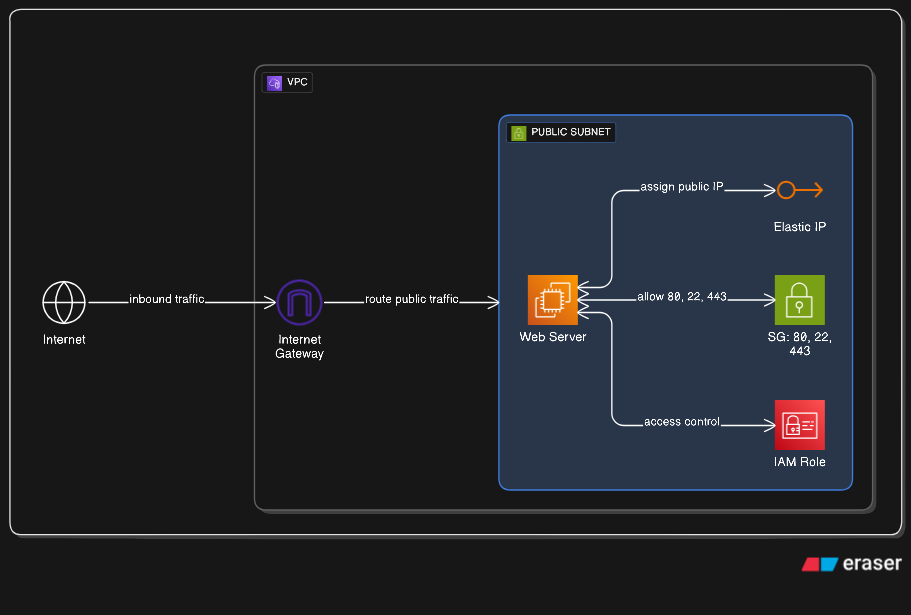
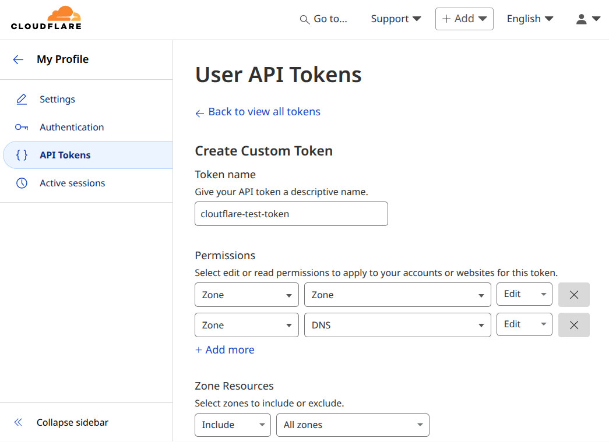

# CF training setup 

### Warning!

Cloudflare restrict the creation of partial domains to 
business customers; trying to set them up fails with
an error. 

https://community.cloudflare.com/t/terraform-partial-zone-signup-not-allowed/383187

This means that the last step (create a CF zone for the
second domain) will need to be done when the account
is upgraded.

Still, this terraform deployment creates in r53's domain2

- An A record internal.webserver_name -> the webserver address
- A CNAME in the form:  
    webserver_name -> internal.webserver_name.domain2.cdn.cloudflare.net

What needs to be done is to configure the partial zone on the CF console.

## 1. Log in to the CloudFlare console, and create an API token.

**NOTE:** While you are logged in the console, note down
your Cloudflare Account ID: it is the alphanumerical string you
see in the URL, when you are on your dashboard:

https://dash.cloudflare.com/**ACCOUNT-ID**/home/domains

You will need it later.

The first thing to to is to create an API token with the correct permisions.

    Zone > Zone > Edit (for writing/creating zones)
    Zone > DNS > Edit (for editing DNS records within zones)

1. From the main dashboard page, select your profile (top right icon).

2. Select "API tokens" from the menu on the right.

3. Click on "Create Token", and select "custom token" at the very end.

4. Select the two privileges above, give the token an expiration date and save

5. Note down the token.

To make it usable, assign the token value to a shell variable.

If you are using bash, add this line to your .bashrc

    export CLOUDFLARE_API_TOKEN="<your secret token>"

You should be good to go.

## 2. (if you don't already have it) Create an AWS access key, and an ssh key

Once you have created the credential, put it into your `~/.aws/credentials` file:

    [default]
    aws_access_key_id =  <access key ID>
    aws_secret_access_key =  <secret access key>

## 3. Buy two cheap domains on R53. The cheaper, the better

The `.link` domain is just 5 dollars!

## 4. In the AWS console, create a SSH key connect to your instance.

Make sure you note down the key name, you will need it later.

## 4. Create a file terraform.tfvars with these variables

    key_name              = "<your ssh key name>"
    domain1name           = "<your first domain>"
    domain2name           = "<your second domain>"
    webserver_name        = "<your webserver name>"
    cloudflare_account_id = "<your account ID>"

## 5. Deploy with terraform

From the console, run

- terraform init
- terraform plan

Check that everything looks ok; if it does:

- terraform apply

This will display the name and address of your new endpoint, like this:

        Outputs:

        cloudflare_dns_domain1 = tolist([
        "gene.ns.cloudflare.com",
        "yahir.ns.cloudflare.com",
        ])
        webserver_ip = "63.176.208.52"
        webserver_url = "http://www.test.net17.link"

Wait a bit, then try and connect (http only). 

You should be able to verify that your host is
now on CloudFlare by using

    dig <your host> -t a

You should see your content being served by a number
of CF caches

        dig www.test.net17.link -t a

        ; <<>> DiG 9.18.30-0ubuntu0.24.04.2-Ubuntu <<>> www.test.net17.link -t a
        ;; global options: +cmd
        ;; Got answer:
        ;; ->>HEADER<<- opcode: QUERY, status: NOERROR, id: 26231
        ;; flags: qr rd ra; QUERY: 1, ANSWER: 7, AUTHORITY: 0, ADDITIONAL: 1

        ;; OPT PSEUDOSECTION:
        ; EDNS: version: 0, flags:; udp: 65494
        ;; QUESTION SECTION:
        ;www.test.net17.link.		IN	A

        ;; ANSWER SECTION:
        www.test.net17.link.	254	IN	A	104.21.32.1
        www.test.net17.link.	254	IN	A	104.21.112.1
        www.test.net17.link.	254	IN	A	104.21.64.1
        www.test.net17.link.	254	IN	A	104.21.80.1
        www.test.net17.link.	254	IN	A	104.21.48.1
        www.test.net17.link.	254	IN	A	104.21.16.1
        www.test.net17.link.	254	IN	A	104.21.96.1

        ;; Query time: 0 msec
        ;; SERVER: 127.0.0.53#53(127.0.0.53) (UDP)
        ;; WHEN: Tue Sep 02 13:08:29 CEST 2025
        ;; MSG SIZE  rcvd: 160

## 6 Connect to the webserver

You should be able to use the ssh key you specified
in step 4, with username `ubuntu`.

## To do:

- The free plan does not allow partial onboarding of customer zones; still, everything is already set up,
  once the account is upgraded this can easily be done on the cloudflare console.
- HTTPS: will need to investigate how certs work with Cloudflare (as they will be answering for this domain)